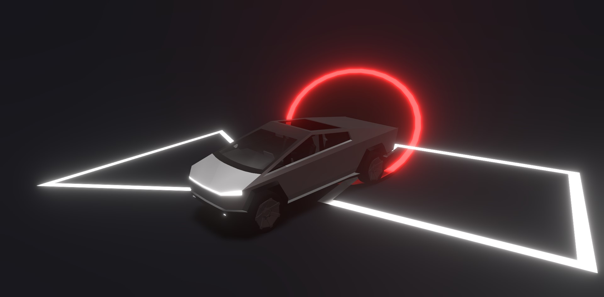

## React Three Fiber Cybertruck 3D Model
<h4>by Syed Anas Tanweer</h4>

<!-- <p>Boilerplate repo for React Three Fiber app using Next.js and Typescript</p> -->

<p align="center">
    <a href="https://r3f-tesla-cybertruck.vercel.app/" target="_blank"></a>
</p>

## Live Link
Click here: <a href="https://r3f-tesla-cybertruck.vercel.app/" target="_blank">https://r3f-tesla-cybertruck.vercel.app/</a>


## Getting Started
Download and install Node.js on your computer (https://nodejs.org/en/download/).

Then, open VSCODE, drag the project folder to it. 
Open VSCODE terminal and install dependencies (you need to do this only in the first time)

<h4>Install node modules:</h4>

Run this command for install node modules.

```
npm i
```

After install node modules, Run this command in your terminal to open a local server at localhost:5173

```
npm run dev
```

You can replace the model and change the camera animations to make your own scene.

Open [http://localhost:5173](http://localhost:5173) with your browser to see the result.

<!-- You can start editing the page by modifying `pages/index.gsx`. The page auto-updates as you edit the file. -->

[API routes](https://nextjs.org/docs/api-routes/introduction) can be accessed on [http://localhost:1000/api/hello](http://localhost:1000/api/hello). This endpoint can be edited in `pages/api/hello.ts`.

The `pages/api` directory is mapped to `/api/*`. Files in this directory are treated as [API routes](https://nextjs.org/docs/api-routes/introduction) instead of React pages.

## Notes
Would be really appreciated if you are willing to give me a star here on GitHub 🎉


### Cybertruck 3D Model credits

"Tesla Cybertruck" (https://skfb.ly/6QSBr) by hashikemu is licensed under Creative Commons Attribution (http://creativecommons.org/licenses/by/4.0/).
